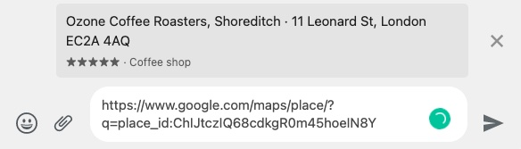

# Google no-API tools

🤠 Life is too short to set-up an account on GCP

## Use-cases

### [`placeInfoFromURL`](./src/extractors/maps.ts)

Gets data from a Google Maps URL preview, such as the picture below, using the HTTP `meta` tags



```js
const { placeInfoFromURL } = require("@brunoluiz/google-no-api-tools");

(async () => {
  const res = await placeInfoFromURL("https://www.google.com/maps/place/?q=place_id:ChIJtczIQ68cdkgR0m45hoeIN8Y");
  console.log(res);
})();

/*
Response:
{
  slug: 'ozone-coffee-roasters-shoreditch',
  name: 'Ozone Coffee Roasters, Shoreditch',
  type: 'Coffee shop',
  address: '11 Leonard St, London EC2A 4AQ',
  rating: 5,
  url: 'https://www.google.com/maps/place/?q=place_id:ChIJtczIQ68cdkgR0m45hoeIN8Y',
  photo: 'https://lh5.googleusercontent.com/p/AF1QipMvEB-44Gi4KMq8BZzH24pOlC7oGQ6uP8uSfXag=w512-h512-k-no-p'
}
*/
```
